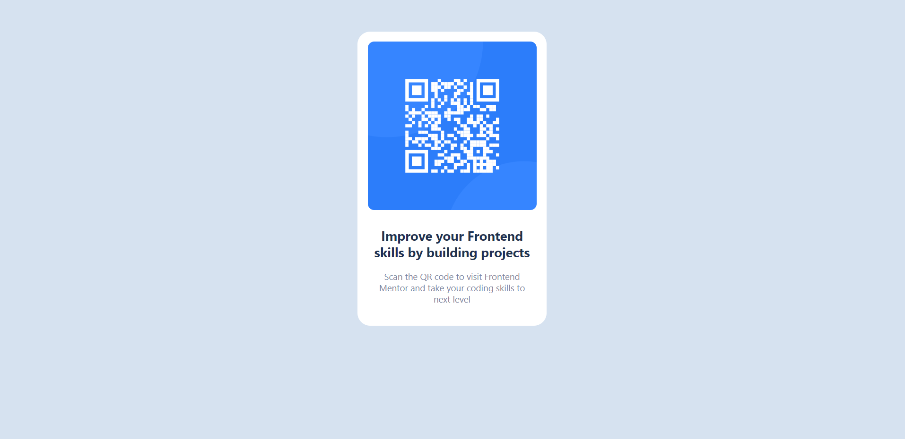

# Frontend Mentor - QR code component solution

This is a solution to the [QR code component challenge on Frontend Mentor](https://www.frontendmentor.io/challenges/qr-code-component-iux_sIO_H). Frontend Mentor challenges help you improve your coding skills by building realistic projects. 

## Table of contents

- [Overview](#overview)
  - [Screenshot](#screenshot)
  - [Links](#links)
- [My process](#my-process)
  - [Built with](#built-with)
  - [What I learned](#what-i-learned)
  <!-- - [Useful resources](#useful-resources) -->
- [Author](#author)
- [Acknowledgments](#acknowledgments)

## Overview
Here, I have created a simple QR code component using good CSS practice. I have used woff2 format of font locally instead of using CDN.

### Screenshot

### Links

- Solution URL: [At Frontend Mentor](https://www.frontendmentor.io/solutions/qrcodecomponentsolution-QT32soV0-J)
- Live Site URL: [Click Here](https://nimble-beignet-95d5e1.netlify.app/)
## My process
- Since this was a simple project, I put all the elements within a main tag instead of creating separate div for each components.
- I created reusable variables for colors and font faces.
- I choosed to save fonts locally instead of using CDN from google fonts.

### Built with

- Semantic HTML5 markup
- CSS custom properties
- CSS Grid
- Mobile-first workflow
- [Styled Components](https://styled-components.com/) - For styles

### What I learned
- To use CSS variables efficiently
- To change ttf format font to woff2 with the help of npm package
- To center a div 🤷‍♂️

<!-- ### Useful resources

- [Example resource 1](https://www.example.com) - This helped me for XYZ reason. I really liked this pattern and will use it going forward.
- [Example resource 2](https://www.example.com) - This is an amazing article which helped me finally understand XYZ. I'd recommend it to anyone still learning this concept. -->

## Author

<!-- - Website - [Add your name here](https://www.your-site.com) -->
- Frontend Mentor - [@Pin3appl3ishan](https://www.frontendmentor.io/profile/yourusername)
<!-- - Twitter - [@yourusername](https://www.twitter.com/yourusername) -->

## Acknowledgments
Thanks to the frontend mentor for providing this challenge and [Andreas Remdt](https://www.youtube.com/@AndreasRemdt) for helping out with the project.